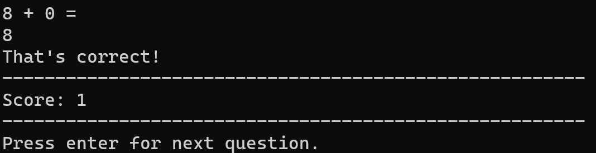

# MathGame

  
Table of Contents

  <ol>
    <li><a href="#about-the-project">About The Project</a>
      <ul>
        <li><a href="#menu">Menu</a>
          <ul>
            <li><a href="#mini-games">Mini Games</a>
            <li><a href="#change-game-difficulty">Change Game Difficulty</a>
            <li><a href="#view-game-history">View Game History</a>
          </ul>
      </ul>        
    <li><a href="#built-with">Built With</a></li>
    <li><a href="#installation">Installation</a>
      <ul>
        <li><a href="#prerequisites">Prerequisites</a>
        <li><a href="#steps">Steps</a>
      </ul>
    <li><a href="#working-on-feedback">Working On Feedback</a></li>
    <li><a href="#future-changes">Future Changes</a></li>
    <li><a href="#contact">Contact</a>
  </ol>

## About the Project
This is a math game that I used to practice my OOP skills! 
It was created as a console app on Microsoft Visual Studio. This application was created for my nephew, so he could practice his mathematics in a fun way!

## Menu 
In the menu, you can choose to play one of the games, change the difficulty of the games, view past games or quit the program.

  

### Mini Games
In the menu, you can choose to either play the `Addition`, `Subtraction`, `Multiplication` or `Division` game.
Below is a snippet of if the user picked the `Addition` game!

  

#### Change Game Difficulty
The user is able to adjust the difficulty of the games. The program displays messages explaining the differences between each difficulty.

  

#### View Game History
The program allows the user to see past games played. The program deletes any game history older than 30 days. The user can choose the see either higher scores at the top or the lowest scores at the top. The program prioritises the date, then the score order. The user can also choose if they want to see the scores of one of the specific mini games or of all the mini games!

  
  

## Built With
This project was built using the following technologies and languages:
- C#
- .NET
- Microsoft Visual Studio
- MySQL

## Installation
### Prerequisites
You will need to install Microsofot Visual Studio and MySQL.
You will then need to create a database in your localhost called `mathgame_db`, and create a table `game_history` with columns `game_date DATE`, `game_type VARCHAR(20)`, `score INT` and `game_difficulty VARCHAR(20)`.

### Steps
1. Download the `FinishedApp` folder. If it is zipped, extract it to your chosen location.
2. Create an `app.config` file in the `MathGame` folder with the connection string to your MySQL database. It should look something like this:
`<add name="mathgame_db" connectionString="server=localhost;userid=root;password=[YourPassword];database=mathgame_db" providerName="System.Data.SqlCLient"/>`
3. Create a shortcut to the `MathGame` aplication file, and move the shortcut to your desktop.

## Working on Feedback
I posted my last project, the [C# and MySQL Password Manager](https://github.com/NahdaaJ/PasswordManager_CSharp) on the C# Reddit forum so that I could receive feedback on my project. The post can be found [here](https://www.reddit.com/r/csharp/comments/13ekgq3/created_my_first_c_project/). As I have been teaching myself all these languages and technologies, I'm not always sure if I'm learning bad practices or not. I thought that having some insights from professionals or long-time hobbyists would help me learn more, and it definitely did!

The feedback I received:
- **Look into SQL Injection** - I made sure that no command string in my program was created directly from user text input.
- **A lot of unnecessary files were pushed to the GitHub repo** - I learnt how to use a `.gitignore` file and incorporated one into this project.
- **Password was openly posted on GitHub through my code** - this time around, I created an app.config file that I then put in the `.gitingore`.
- **Too much code and logic in main** - this one was difficult, but I tried to put all my logic and important variables into related classes. 
- **Use interpolated strings** - this definitely made my code cleaner and easier for me to understand!
- **Too many random comments, bad naming** - I made sure my comments either helped me or specifically explained a part of weird code, and named everything more intuitively.
- **Too much repetition** - I created a class with methods for things that I would have to call repeatedly, and kept trying to keep my code DRY.

## Future Changes
In the future I would like to implement a GUI for this program as the program is primarily aimed for children. This would make it more fun and exciting!
For this project, I also used a local database on the MySQL workbench. In the future, I would like to use a server database so that users don’t have to download MySQL and create the database.

## Acknowledgements
I would like to thank everyone who gave me feedback on my reddit post! The feedback, links and insights were incredibly helpful! 

## Contact

  <a href="https://www.linkedin.com/in/nahdaa-jawed/">My LinkedIn</a>

